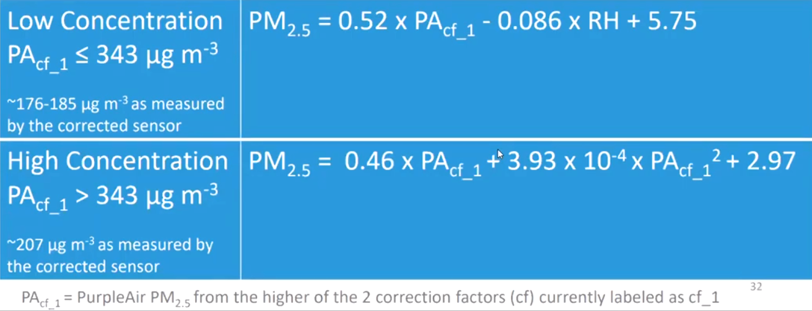

```{r setup, include=FALSE}
knitr::opts_chunk$set(echo = TRUE)
library(tinytex)
# Had to run tinytex::install_tinytex()
```


# Motivation
## Clean Air
- The Clean Air Act (1970) established National Ambient Air Quality Standards
(NAAQS) for US counties.

- Binary standards: either "attainment" or "non-attainment"

<!-- - Annual and Daily standards that both must be met. -->

<!-- - Regulatory penalties levied on non-attainment areas can be large. -->
    
- Air quality can vary significantly throughout a day, week, quarter.

<!-- add space here -->
- NAAQS only requires each monitor to report 75\% of their readings, per quarter.

- EPA pollution monitors can be shut off for unreported reasons.


## Research Questions

- How biased is *missing* air pollution data from self-reporting US EPA monitors?

- Does this bias significantly change NAAQS attainment status?


# Project Overview
<!-- :
     latex_engine: xelatex
header-includes:
   - \usetheme[style=dark]{Nord}
   - \usepackage{YGbeamer}
(i) an interesting, well-posed question; 
(ii) an adequate model, such that the question makes sense within the context of
the model; 
(iii) an identification strategy, such that (again within the context of the 
model) the question can be answered; 
“What is your identification strategy?” = “What research design (and assumptions) are you using?”
(iv) a set of proposed hypothesis tests or statistics which map your
data into falsifiable statements that can provide answers to your question. You
should /not/ provide any results; this presentation is about empirical strategy,
not about data-dependent outcomes.
-->


## Previous Works
- Spotting Strategic Behavior in EPA Monitor Shutoffs:
Mu et al. 2021
<!-- [ put more here on strategic behavior evidence that motivates the interest in measuring -->
<!-- the size / distribution of bias in missing data/] -->

- Strategic decisions of monitor locations: Grainger et al. 2017

- Using satellite data to fill gaps in air pollution monitoring: Sullivan, Krupnick 2018

- Prediction error is significant in satellite-based estimates of air pollution: Fowlie, Rubin, Walker 2019

## This project
- Focus on EPA pollution data that is missing *in time*; limited to California.
- Using new consumer-based pollution monitors to understand the bias in EPA data.
- Avoids using satellite estimates (has been shown to have significant error).
<!-- - Understanding the distribution of bias in missing California air pollution data using consumer-based pollution -->
<!-- monitors that have low error near their location. -->

# Purple Air Monitors
[insert maps of California EPA and PA monitors, timelaps GIF? Timeline of adoption]

[insert pictures of PA outdoor monitors]


# Models

1. Predict EPA pollution at missing times

2. Estimate bias between predicted pollution at missing times and reported pollution at nonmissing times.

3. Estimate California counties' counterfactual attainment status using included predicted missing pollution data.


# Models: Predictive model of each EPA monitor PM2.5 pollution

\[
EPA_{i,t} = \gamma_{i,0} + \sum\limits_{j\in J_i}\sum\limits_{k=1}^7\gamma_{j,k} PA_{j,t} + u_{i,t}
\]

- Analysis done at the month and quarter level; suppressing that subscript.
- $t$ is a unique hour within a given month or quarter.
- EPA monitor $i$ at time $t$ reads PM2.5 pollution $EPA_{i,t}$.
- For each EPA monitor $i$, there are $J_i$ Purple Air monitors within a 10-mile radius.
[insert diagram of two EPA monitors with PA monitors surrounding them]
- Purple Air monitor $j\in J_i$ at time $t$ reads PM2.5 pollution $PA_{j,t}$.
[insert diagram of one EPA monitor and surrounding PA monitors, with wind directions]

# Models: Hour-by-Day-of-week Bias of Missing EPA Monitor Pollution Data
\def\mm{\mathcal{M}}
\def\nn{\mathcal{N}}
\vspace{-1em}
\begin{align*}
\intertext{\textbf{Missingness Bias:}}
Bias_{i,h,d} &= \frac{1}{|\nn_{i,h,d}|}\sum\limits_{t\in \nn_{i,h,d}}EPA_{i,t} 
- \frac{1}{|\mm_{h,d}|}\sum\limits_{t\in \mm_{h,d}}\widehat{EPA}_{i,t}\\
\text{where } \mm_{i,h,d}&= \{t: t\text{ is at hour $h$ and day $d$ and $EPA_{i,t}$ is Missing}\};\\
  \nn_{i,h,d}&= \{t: t\text{ is at hour $h$ and day $d$ and $EPA_{i,t}$ is Non-missing}\} \\
\uncover<2->{\intertext{We can also define the \textbf{algorithm bias}     as the Hour-by-Day-of-week prediction error}
\widetilde{Bias}_{i,h,d} &= \frac{1}{|\nn_{i,h,d}|}\sum\limits_{t\in \nn_{i,h,d}}EPA_{i,t} 
- \frac{1}{|\mm_{h,d}|}\sum\limits_{t\in \mm_{h,d}}\widehat{EPA}_{i,t} \\}
\uncover<3->{\intertext{We can also define $Bias_{j,h,d}$ and $\widetilde{Bias}_{j,h,d}$ for PA monitor $j$ (we'll come back to this).}}
\end{align*}

<!-- \begin{itemize}[<+->] -->
<!-- \item \begin{align*} -->
<!-- Bias_{i,h,d} &= \frac{1}{|\nn_{i,h,d}|}\sum\limits_{t\in \nn_{i,h,d}}EPA_{i,t}  -->
<!-- - \frac{1}{|\mm_{h,d}|}\sum\limits_{t\in \mm_{h,d}}\widehat{EPA}_{i,t}\\ -->
<!-- \text{where } \mm_{i,h,d}&= \{t: t\text{ is at hour $h$ and day $d$ and $EPA_{i,t}$ is Missing}\};\\ -->
<!--   \nn_{i,h,d}&= \{t: t\text{ is at hour $h$ and day $d$ and $EPA_{i,t}$ is Non-missing}\} -->
<!-- \end{align*} -->

<!-- \item We can also define the algorithm bias as the Hour-by-Day-of-week prediction error -->
<!-- \[ -->
<!-- \widetilde{Bias}_{i,h,d} = \frac{1}{|\nn_{i,h,d}|}\sum\limits_{t\in \nn_{i,h,d}}EPA_{i,t}  -->
<!-- - \frac{1}{|\mm_{h,d}|}\sum\limits_{t\in \mm_{h,d}}\widehat{EPA}_{i,t} -->
<!-- \] -->

<!-- \item We can also define $Bias_{j,h,d}$ and $\widetilde{Bias}_{j,h,d}$ for PA monitor $j$ (we'll come back to this). -->
<!-- \end{itemize} -->


# Models: County Attainment Status

\begin{align*}
Attain^{annual}_c &= 1 \text{ if \textbf{reported} annual average PM2.5 below threshold}^*\\
  &= 1[\text{equation here}]\\[1em]
Attain^{daily}_c &= 1 \text{ if 98$^{th}$ percentile of \textbf{reported} daily average PM2.5 below threshold}^*\\
  &= 1[\text{equation here}]\\[1em]
\widehat{Attain}^{annual}_c &= 1 \text{ if \textbf{predicted} annual average PM2.5 below threshold}^*\\[1em]
\widehat{Attain}^{daily}_c &= 1 \text{ if 98$^{th}$ percentile of \textbf{predicted} daily average PM2.5 below threshold}^*
\end{align*}
$^*$averaged over 3 years in NAAQS standard.
[fill in equations and thresholds]


# Identification Strategy

- Direct causal link between reported pollution levels, attainment status, and
regulatory penalties / attainment requirements

- Assumption: nearby PurpleAir monitors that are good predictors for EPA monitors
during non-missing times will also be good predictors during missing times.
  - Specifically, reasons for EPA data missingness are not correlated with missingness
  or measurement error in PurpleAir data


# Proposed Statistical Test

- The $J_i$ group of PurpleAir sensors is (in a sense) a synthetic control for the EPA sensor $i$.

- **The question of bias can be stated**: are the data observed during the times when the EPA monitor is turned off significantly different from the data observed when the monitor is turned on? Is it more different than by random chance?

- Implies an Abadie et al. 2011 style permutation inference test for each EPA monitor $i$.


# Proposed Statistical Test (Is the bias larger than by random chance?)

- Calculate missingness bias and algorithm bias for the EPA monitor

- Pick PA monitor $j\in J_i$, temporarily remove data for original hours missing from EPA monitor ($\mm_{i,h,d}$).

- Construct similar placebo synthetic control for PA monitor $j$ (predict $\widehat{PA}_{j,t}$).

- Calculate missingness bias and algorithm bias for the PA monitor: $Bias_{j,h,d}$

- Repeat for all PA sensors.

- **Graphical test**: For EPA sensor $i$, compare graph of $Bias_{i,h,d}$ to placebo $Bias_{j,h,d}$ for $j\in J_i$.

- **Permutation inference p-value**: 

  - Calculate sum of squared missingness bias and sum of squared algorithm bias for EPA sensor $i$ and PA sensors $j\in J_i$.
  \vspace{0.5em}
  - Ratio$_k$ = sum of squared missingness bias / sum of squared algorithm bias
  \vspace{0.5em}
  - p-value = $\frac{\text{\# of PA sensors in $i$'s radius with Ratio$_j$ larger than Ratio$_i$}}{\text{\# of PA sensors in $i$'s radius}}$


# Extensions

- Welfare analysis based on attainment status changes and required reductions in pollution.

- Comparing county population-weighted PM2.5 pollution to EPA sensors to estimate location-based bias.


# Appendix A: PurpleAir monitor correction factor

{width=50%}


\beamerdefaultoverlayspecification{}
# Appendix B: Data Plan
### Datasets

- Hourly PM2.5 Pollution data from California EPA pollution monitors (2015-2020)

- 2-minute PM2.5 Pollution data from California PurpleAir sensors, hourly averages taken


### Deadlines
- Dec. 5: PurpleAir is downloading/averaging on 4 AWS tiny linux instances, sending CSVs to S3 bucket
- Dec. 12: Proof of concept for 2 EPA sensors (Fresno, and [need to pick another low on Mu's list])
- Dec. 19: Data warehouse setup and transfer of existing Purple Air data

# Appendix B: Data Plan

### Data Wearhouse
- AWS Linux Cassandra database (noSQL columnar, designed for large queries of columns)
- Python pushes and pulls

### Storage costs
- ~ 30,000 sensors, 50 variables, 2 minute intervals, 5 years of data = 107.55 Terabytes
- Depending on method of storage: \$2,900 - \$13,300 per month
- Only storing hourly means and SD: \$4 - \$15 per month


<!-- Extra
# Example
### Two EPA monitors:
- Fresno (Mu et al. identified as "interesting")
- other county low on the interesting list


# Data Plan
### Datasets

### Calendar

### Data Wearhouse
- AWS Linux Cassandra database (noSQL columnar, designed for large queries of columns)

### storage costs
- ~ 30,000 sensors, 50 variables, 2 minute intervals, 5 years of data = 107.55 Terabytes
- Depending on method of storage: \$2,900 - \$13,300 per month
- Only storing hourly means and std. deviations: \$4 - \$15 per month


-->


