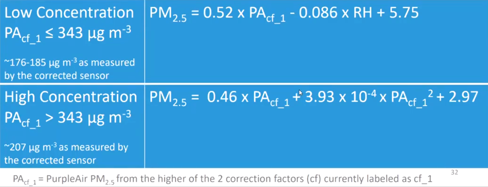

```{r setup, include=FALSE}
knitr::opts_chunk$set(echo = TRUE)
library(tinytex)
# Had to run tinytex::install_tinytex() to use XeLaTeX if using YGbeamer.sty
```

```{r packages, include=F}
library(tidyverse)
library(docstring)
library(ggplot2)
# library(mapdata)
# Requires rgdal package to be installed, requires gdal to be installed on computer
# Ubuntu 20.04: sudo aptitude install gdal-bin proj-bin libgdal-dev libproj-dev
```


# Motivation
## Clean Air

- The Clean Air Act (1970) established National Ambient Air Quality Standards
(NAAQS) for US counties.

- Binary standards: either "attainment" or "non-attainment"
    
- Air quality can vary significantly throughout a day, week, quarter.

- NAAQS only requires each monitor to report 75\% of their readings, per quarter.

- EPA pollution monitors can be shut off for unreported reasons.

<!-- - Annual and Daily standards that both must be met. -->

<!-- - Regulatory penalties levied on non-attainment areas can be large. -->

## Research Questions

- How biased are EPA monitor-based measures of local air quality?
<!-- - How biased are self-reported EPA pollution estimates? -->
<!-- - How biased is *missing* air pollution data from self-reporting US EPA monitors? -->

- Does this bias significantly change NAAQS attainment status?


# Context
<!-- :
     latex_engine: xelatex
header-includes:
   - \usetheme[style=dark]{Nord}
   - \usepackage{YGbeamer}
(i) an interesting, well-posed question; 
(ii) an adequate model, such that the question makes sense within the context of
the model; 
(iii) an identification strategy, such that (again within the context of the 
model) the question can be answered; 
“What is your identification strategy?” = “What research design (and assumptions) are you using?”
(iv) a set of proposed hypothesis tests or statistics which map your
data into falsifiable statements that can provide answers to your question. You
should /not/ provide any results; this presentation is about empirical strategy,
not about data-dependent outcomes.
-->


## Previous Works
- Spotting Strategic Behavior in EPA Monitor Shutoffs:
Mu et al. 2021
<!-- [ put more here on strategic behavior evidence that motivates the interest in measuring -->
<!-- the size / distribution of bias in missing data/] -->

- Strategic decisions of monitor locations: Grainger et al. 2017

- Using satellite data to fill gaps in air pollution monitoring: Sullivan, Krupnick 2018

- Prediction error is significant in satellite-based estimates of air pollution: Fowlie, Rubin, Walker 2019

## This project
- Using new consumer-based pollution monitors (PurpleAir).

- Focus on EPA pollution data that is missing *in time*.

- Avoids using satellite estimates (has been shown to have significant error).
<!-- - Understanding the distribution of bias in missing California air pollution data using consumer-based pollution -->
<!-- monitors that have low error near their location. -->


<!-- [why California? Maybe should inlcude all EPA monitor - months that have at least one PA monitor within 10 miles] -->

<!-- [insert maps of California EPA and PA monitors, timelaps GIF? Timeline of adoption] -->

<!-- [insert pictures of PA outdoor monitors] -->

```{r geography intersection functions, include=F}
library(sf)
library(spData)

lonlat_to_state <- function(df, lon_col, lat_col,
                            states = spData::us_states,
                            name_col = "NAME") {
  #' State names for lon, lat vectors
  #' 
  #' @description Return a vector of state names for the lon-lat vectors
  #' 
  #' @param df: a data.frame containing lon lat pairs
  #' 
  #' @param lon_col: A character of the column name containing longitude
  #' 
  #' @param lat_col: A character of the column name containing latitude
  #'
  #' @param states:   An sf MULTIPOLYGON object with 50 states plus DC.
  #'
  #' @param name_col: Name of a column in `states` that supplies the states'
  #'           names.
  #' https://stackoverflow.com/a/8751965/16660792
  ## Convert points data.frame to an sf POINTS object
  pointsDF = data.frame(x = df[, lon_col], y = df[, lat_col])
  pts <- st_as_sf(pointsDF, coords = 1:2, crs = 4326)

  ## Transform spatial data to some planar coordinate system
  ## (e.g. Web Mercator) as required for geometric operations
  states <- st_transform(states, crs = 3857)
  pts <- st_transform(pts, crs = 3857)

  ## Find names of state (if any) intersected by each point
  state_names <- states[[name_col]]
  ii <- as.integer(st_intersects(pts, states))
  state_names[ii]
}


lonlat_country_filter <- function(df, lon_col, lat_col,
                                  country='United States',
                                  name_col='name_long') {
  #' Filter for lat-lons in a specific country
  #' 
  #' @description Return the dataframe filtered to inlcude only US points
  #' 
  #' @param df: a data.frame containing lon lat pairs
  #' 
  #' @param lon_col: A character of the column name containing longitude
  #' 
  #' @param lat_col: A character of the column name containing latitude
  #'
  #' @param country: A character of the country, matching name_col from spData::world
  #'
  #' @param name_col: A character of the column name containing the country name,
  #' from spData::world
  #'
  ## Restrict to county boundaries
  country = spData::world %>%
    filter(!!as.symbol(name_col) == country)
  ## Convert points data.frame to an sf POINTS object
  pointsDF = data.frame(x = df[, lon_col], y = df[, lat_col])
  pts <- st_as_sf(pointsDF, coords = 1:2, crs = 4326)

  ## Transform spatial data to some planar coordinate system
  ## (e.g. Web Mercator) as required for geometric operations
  country <- st_transform(country, crs = 3857)
  pts <- st_transform(pts, crs = 3857)

  ## Find names of state (if any) intersected by each point
  ii <- as.integer(st_intersects(pts, country))
  df %>%
    mutate(include = ii) %>%
    filter(include == 1)
}


```


# PM2.5 Air Pollution Monitors

```{r get EPA sensor locations 2016, include=F, cache=T}
sensor_types = c(88101, 88501, 88502)
years = c()

load("/media/a/E/Programming/github/are219/data/epa/epa_monitors/epa_monitors/data_from_api/88101/api_request_daily_88101_2016.Rdata")
df = yr_dt %>% distinct(latitude, longitude, .keep_all = TRUE) %>% mutate(type=88101, NAAQS_used='yes')
load("/media/a/E/Programming/github/are219/data/epa/epa_monitors/epa_monitors/data_from_api/88501/api_request_daily_88501_2016.Rdata")
df2 = yr_dt %>% distinct(latitude, longitude, .keep_all = TRUE) %>% mutate(type=88501, NAAQS_used='no')
load("/media/a/E/Programming/github/are219/data/epa/epa_monitors/epa_monitors/data_from_api/88502/api_request_daily_88502_2016.Rdata")
df3 = yr_dt %>% distinct(latitude, longitude, .keep_all = TRUE) %>% mutate(type=88502, NAAQS_used='no')
epa_data = bind_rows(df, df2, df3) %>%
  filter(type == 88101) %>% 
  distinct(latitude, longitude, .keep_all = TRUE) %>%
  select(longitude, latitude, everything())

```

```{r get PA sensor locations all, include=F}
result = jsonlite::fromJSON("/media/a/E/Programming/github/are219/data/test_data/manual_webpage_download_USmap_2021-11-29.txt")
library(zoo)
# Get start and last_seen dates from all sensors near the US
pa_data2 = as.data.frame(result$data) %>%
  purrr::set_names(result$fields) %>%
  mutate(date_start = lubridate::as_datetime(date_created),
         date_last = lubridate::as_datetime(last_seen),
         month_start = as.yearmon(date_start),
         month_last = as.yearmon(date_last)) %>%
  select(longitude, latitude, everything()) %>%
  arrange(date_start) %>%
  lonlat_country_filter(lon_col='longitude', lat_col='latitude') %>%
  filter(private == 0,  # public sensor
         location_type == 0,  # outdoor sensor
         channel_state != 0)  # has at least one PM sensor
```


```{r Plot the locations, eval=F, include=F}
min_lat = min(pa_data$lat)
max_lat = max(pa_data$lat)
min_lon = min(pa_data$lon)
max_lon = max(pa_data$lon)
print(paste(max_lon, max_lat, min_lon, min_lat))
usa <- map_data('usa', projection='conic', parameters=c(min_lat))

b = 204/255
plot_usmap(fill='white', color='grey') +
  geom_point(data = usmap::usmap_transform(pa_data),   # Purple Air
             aes(x = lon.1, y = lat.1),
             color = rgb(0, b, b), alpha = 1, size=0.4) +
  geom_point(data = usmap::usmap_transform(epa_data),   # EPA
             aes(x = longitude.1, y = latitude.1),
             color = "red", alpha = 0.25, size=2) +
  labs(title = "US EPA & PurpleAir Pollution Monitors",
       subtitle = "Source: EPA, PurpleAir.comJan 1 to Jun 30 2016") +
  theme(legend.position = "right")

```


```{r Monitor Map with AK and HI, include=F}
# devtools::install_github("hrbrmstr/albersusa")
# sudo apt-get install libudunits2-dev
# install.packages('units')
# install.packages('sf')

# Composite map with AK & HI
usa_map = albersusa::usa_composite(proj="laea") %>%
  fortify(.)  # make it usable in ggplot2
epa_trans <- usmap::usmap_transform(epa_data)
pa_trans <- usmap::usmap_transform(pa_data2)

# Plot PA and EPA sensor locations on US map
ggplot() +
  geom_map(data=usa_map, map=usa_map,
                    aes(map_id=id),
                    color="#2b2b2b", size=0.1, fill=NA) +
  geom_point(data = pa_trans, 
             aes(x = longitude.1, y = latitude.1),  # Purple Air
             color = rgb(0, 204/255, 204/255), alpha = 1, size=0.4) +
  geom_point(data = epa_trans, aes(x = longitude.1, y = latitude.1),  # EPA
             color = "red", alpha = 0.25, size=2) +
  labs(title = "US EPA & PurpleAir Pollution Monitors",
       subtitle = "Source: EPA 2016, PurpleAir.com 2015-2021") +
  ggthemes::theme_map()

ggsave('monitor_map_2015-2021.png', width = 6, height = 4)

```

\vspace{-2em}

```{r Map and images, echo=F, warning=F, message=F, fig.width=12, fig.cap='test'}
p_pa = "../../docs/purpleair/PA_outdoor_monitor_border.png"
p_epa = "../../docs/epa/air-monitoring-site_border.jpg"
p_map = 'monitor_map_2015-2021.png'
library(png)
library(jpeg)
library(grid)
library(gridExtra)
img_map = rasterGrob(as.raster(readPNG(p_map)), interpolate = FALSE)
img1 <-  rasterGrob(as.raster(readPNG(p_pa)), interpolate = FALSE)
img2 <-  rasterGrob(as.raster(readJPEG(p_epa)), interpolate = FALSE)

lay = rbind(c(1,2),
            c(1,3))
grid.arrange(img_map, img1, img2,
             layout_matrix = lay,
             widths = c(3,1))
```


```{r animate purpleair adoption, eval=F, include=F}
##Source: https://github.com/thomasp85/gganimate
library(ggplot2)
library(gganimate)
library(gapminder)
## Warning: package 'gapminder' was built under R version 3.4.4
library(gifski)
## Warning: package 'gifski' was built under R version 3.4.4

ggplot(gapminder, aes(gdpPercap, lifeExp, size = pop, colour = country)) +
  geom_point(alpha = 0.7, show.legend = FALSE) +
  scale_colour_manual(values = country_colors) +
  scale_size(range = c(2, 12)) +
  scale_x_log10() +
  facet_wrap(~continent) +
  # Here comes the gganimate specific bits
  labs(title = 'Year: {frame_time}', x = 'GDP per capita', y = 'life expectancy') +
  transition_time(year) +
  ease_aes('linear')


month_counts = pa_data2 %>%
  group_by()

dates <- as.Date(df1$date, '%d/%m/%Y')
yr <- year(dates)
monyr <- as.yearmon(dates)
lst <- lapply(list(dates, yr, monyr), function(x) 
       transform(df1, Count=ave(seq_along(x), x, FUN= length)))
names(lst) <- paste0('newdf', seq_along(lst))
list2env(lst, envir=.GlobalEnv)

```


# Models

\begin{itemize}%[itemsep=1.5em]
\item \textbf{Estimate missing pollution observations:} Use PurpleAir data to predict EPA pollution at missing times
\item \textbf{Estimate bias of reported EPA pollution:} difference between predicted pollution at missing times and reported pollution at nonmissing times.
\item \textbf{Estimate counties' counterfactual attainment status:} Include estimated missing pollution data.
\end{itemize}


# Models: Predictive model of each EPA monitor PM2.5 pollution

\[
EPA_{i,t} = \gamma_{i,0} + \sum\limits_{j\in J_i}\sum\limits_{k=1}^7\gamma_{j,k} PA_{j,t} \cdot Winddir_{i,t,k} + u_{i,t}
\]

- Analysis done at the month and quarter level; suppressing that subscript.

- $t$ is a unique hour within a given month or quarter.

- EPA monitor $i$ at time $t$ reads PM2.5 pollution $EPA_{i,t}$.

- For each EPA monitor $i$, there are $J_i$ Purple Air monitors within a 10-mile radius.

- Purple Air monitor $j\in J_i$ at time $t$ reads PM2.5 pollution $PA_{j,t}$.

<!-- [insert diagram of two EPA monitors with PA monitors surrounding them] -->

- $Winddir_{i,t,k}$ is a wind direction indicator; 1 if the prevailing wind near station $i$ at time $t$ is in the $k^{th}$ bucket (of 8 buckets).

<!-- [insert diagram of one EPA monitor and surrounding PA monitors, with wind directions] -->


# Models: Hour-by-Day-of-week Bias of Missing EPA Monitor Pollution Data
\def\mm{\mathcal{M}}
\def\nn{\mathcal{N}}
\vspace{-1em}
\begin{align*}
\intertext{\textbf{Missingness Bias:}}
Bias_{i,h,d} &= \frac{1}{|\nn_{i,h,d}|}\sum\limits_{t\in \nn_{i,h,d}}EPA_{i,t} 
- \frac{1}{|\mm_{h,d}|}\sum\limits_{t\in \mm_{h,d}}\widehat{EPA}_{i,t}\\
\text{where } \mm_{i,h,d}&= \{t: t\text{ is at hour $h$ and day $d$ and $EPA_{i,t}$ is Missing}\};\\
  \nn_{i,h,d}&= \{t: t\text{ is at hour $h$ and day $d$ and $EPA_{i,t}$ is Non-missing}\} \\
\uncover<2->{\intertext{We can also define the \textbf{algorithm bias}     as the Hour-by-Day-of-week prediction error}
\widetilde{Bias}_{i,h,d} &= \frac{1}{|\nn_{i,h,d}|}\sum\limits_{t\in \nn_{i,h,d}}EPA_{i,t} 
- \frac{1}{|\nn_{h,d}|}\sum\limits_{t\in \nn_{h,d}}\widehat{EPA}_{i,t} \\}
\uncover<3->{\intertext{We can also define $Bias_{j,h,d}$ and $\widetilde{Bias}_{j,h,d}$ for PA monitor $j$ (we'll come back to this).}}
\end{align*}

<!-- \begin{itemize}[<+->] -->
<!-- \item \begin{align*} -->
<!-- Bias_{i,h,d} &= \frac{1}{|\nn_{i,h,d}|}\sum\limits_{t\in \nn_{i,h,d}}EPA_{i,t}  -->
<!-- - \frac{1}{|\mm_{h,d}|}\sum\limits_{t\in \mm_{h,d}}\widehat{EPA}_{i,t}\\ -->
<!-- \text{where } \mm_{i,h,d}&= \{t: t\text{ is at hour $h$ and day $d$ and $EPA_{i,t}$ is Missing}\};\\ -->
<!--   \nn_{i,h,d}&= \{t: t\text{ is at hour $h$ and day $d$ and $EPA_{i,t}$ is Non-missing}\} -->
<!-- \end{align*} -->

<!-- \item We can also define the algorithm bias as the Hour-by-Day-of-week prediction error -->
<!-- \[ -->
<!-- \widetilde{Bias}_{i,h,d} = \frac{1}{|\nn_{i,h,d}|}\sum\limits_{t\in \nn_{i,h,d}}EPA_{i,t}  -->
<!-- - \frac{1}{|\mm_{h,d}|}\sum\limits_{t\in \mm_{h,d}}\widehat{EPA}_{i,t} -->
<!-- \] -->

<!-- \item We can also define $Bias_{j,h,d}$ and $\widetilde{Bias}_{j,h,d}$ for PA monitor $j$ (we'll come back to this). -->
<!-- \end{itemize} -->


# Models: County Attainment Status

\begin{align*}
Attain^{annual}_c &= 1 \text{ if \textbf{reported} annual average PM2.5 below 15.0 $\mu$g/m$^3$}^*\\[1em]
Attain^{daily}_c &= 1 \text{ if 98$^{th}$ percentile of \textbf{reported} daily average PM2.5 below 35 $\mu$g/m$^3$}^*\\[1em]
\widehat{Attain}^{annual}_c &= 1 \text{ if \textbf{predicted} annual average PM2.5 below threshold}^*\\[1em]
\widehat{Attain}^{daily}_c &= 1 \text{ if 98$^{th}$ percentile of \textbf{predicted} daily average PM2.5 below threshold}^*
\end{align*}
$^*$averaged over 3 years in NAAQS standard.
[fill in equations and thresholds]


# Identification Strategy

- Direct causal link between reported pollution levels, attainment status, and
regulatory penalties / attainment requirements

- Assumption: nearby PurpleAir monitors that are good predictors for EPA monitors
during non-missing times will also be good predictors during missing times.

  - Specifically, reasons for EPA data missingness are not correlated with missingness
  or measurement error in PurpleAir data


# Proposed Statistical Test

- The $J_i$ group of PurpleAir sensors is (in a sense) a synthetic control for the EPA sensor $i$.

- **The question of bias can be stated**: are the data observed during the times when the EPA monitor is turned off significantly different from the data observed when the monitor is turned on? Is it more different than by random chance?

- Implies an Abadie et al. 2011 style permutation inference test for each EPA monitor $i$.


# Proposed Statistical Test (Is the bias larger than by random chance?)

- Calculate missingness bias and algorithm bias for the EPA monitor

- Pick PA monitor $j\in J_i$, temporarily remove data for original hours missing from EPA monitor ($\mm_{i,h,d}$).

- Construct similar placebo synthetic control for PA monitor $j$ (predict $\widehat{PA}_{j,t}$).

- Calculate missingness bias and algorithm bias for the PA monitor: $Bias_{j,h,d}$

- Repeat for all PA sensors.


# Proposed Statistical Test (Is the bias larger than by random chance?)

- **Graphical test**: For EPA sensor $i$, compare graph of $Bias_{i,h,d}$ to placebo $Bias_{j,h,d}$ for $j\in J_i$.

- **Permutation inference p-value**: 

  - Calculate sum of squared missingness bias and sum of squared algorithm bias for EPA sensor $i$ and PA sensors $j\in J_i$.
  \vspace{1em}
  - Ratio$_k$ = sum of squared missingness bias / sum of squared algorithm bias
  \vspace{1em}
  - p-value = $\frac{\text{\# of PA sensors in $i$'s radius with Ratio$_j$ larger than Ratio$_i$}}{\text{\# of PA sensors in $i$'s radius}}$
  
<!-- But how does this account for poor prediction of the monitor?
Because the denominator is larger if poor prediction in non-missing observations -->


# Extensions

- Welfare analysis based on attainment status changes and required reductions in pollution.

- Comparing county population-weighted PM2.5 pollution to EPA sensors to estimate location-based bias.


# Appendix A: PurpleAir monitor correction factor

{width=50%}

Source: \url{https://www.epa.gov/air-sensor-toolbox/technical-approaches-sensor-data-airnow-fire-and-smoke-map}

\beamerdefaultoverlayspecification{}
# Appendix B: Data Plan
### Datasets

- Hourly PM2.5 Pollution data from California EPA pollution monitors (2015-2020)

- 2-minute PM2.5 Pollution data from California PurpleAir sensors, hourly averages taken


### Deadlines
- Dec. 5: PurpleAir is downloading/averaging on 4 AWS tiny linux instances, sending CSVs to S3 bucket
- Dec. 12: Proof of concept for 2 EPA sensors (Fresno, and [need to pick another low on Mu's list])
- Dec. 19: Data warehouse setup and transfer of existing Purple Air data


# Appendix B: Data Plan

### Data Wearhouse
- AWS Linux Cassandra database (noSQL columnar, designed for large queries of columns)
- Python pushes and pulls

### Storage costs
- ~ 30,000 sensors, 50 variables, 2 minute intervals, 5 years of data = 107.55 Terabytes
- Depending on method of storage: \$2,900 - \$13,300 per month
- Only storing hourly means and SD: \$4 - \$15 per month


# Appendix C: PurpleAir Takeup
{width=60%}


<!-- Extra
# Example
### Two EPA monitors:
- Fresno (Mu et al. identified as "interesting")
- other county low on the interesting list


# Data Plan
### Datasets

### Calendar

### Data Wearhouse
- AWS Linux Cassandra database (noSQL columnar, designed for large queries of columns)

### storage costs
- ~ 30,000 sensors, 50 variables, 2 minute intervals, 5 years of data = 107.55 Terabytes
- Depending on method of storage: \$2,900 - \$13,300 per month
- Only storing hourly means and std. deviations: \$4 - \$15 per month


-->


