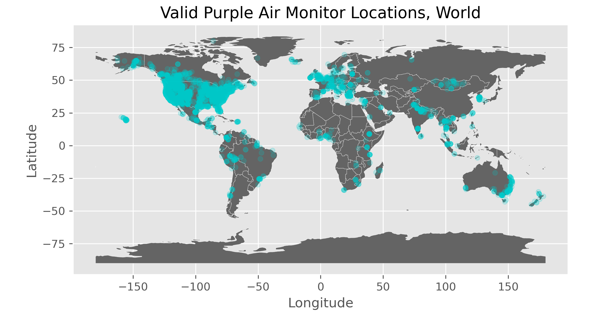
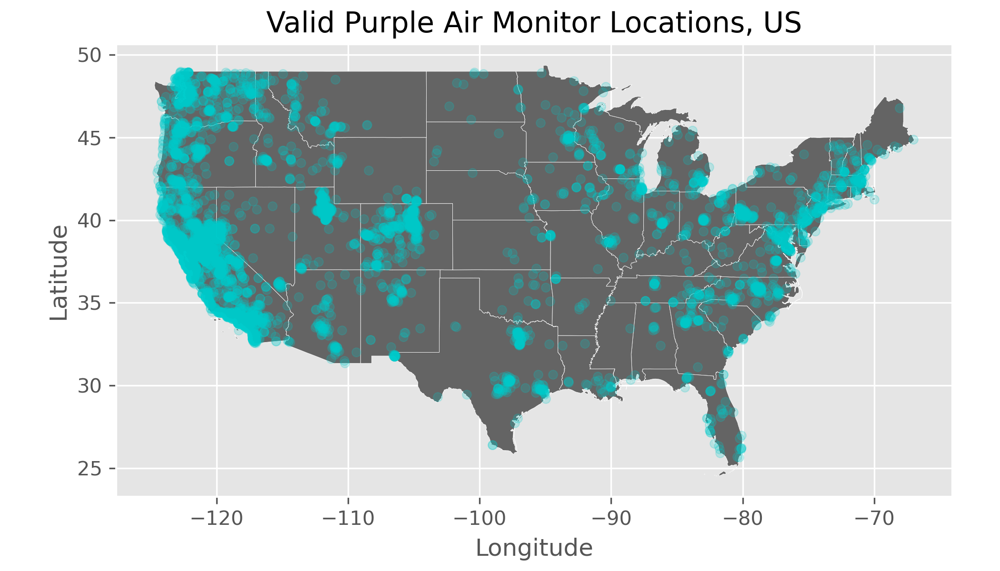
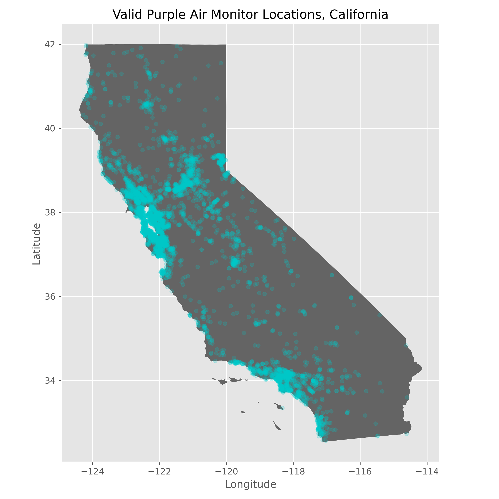
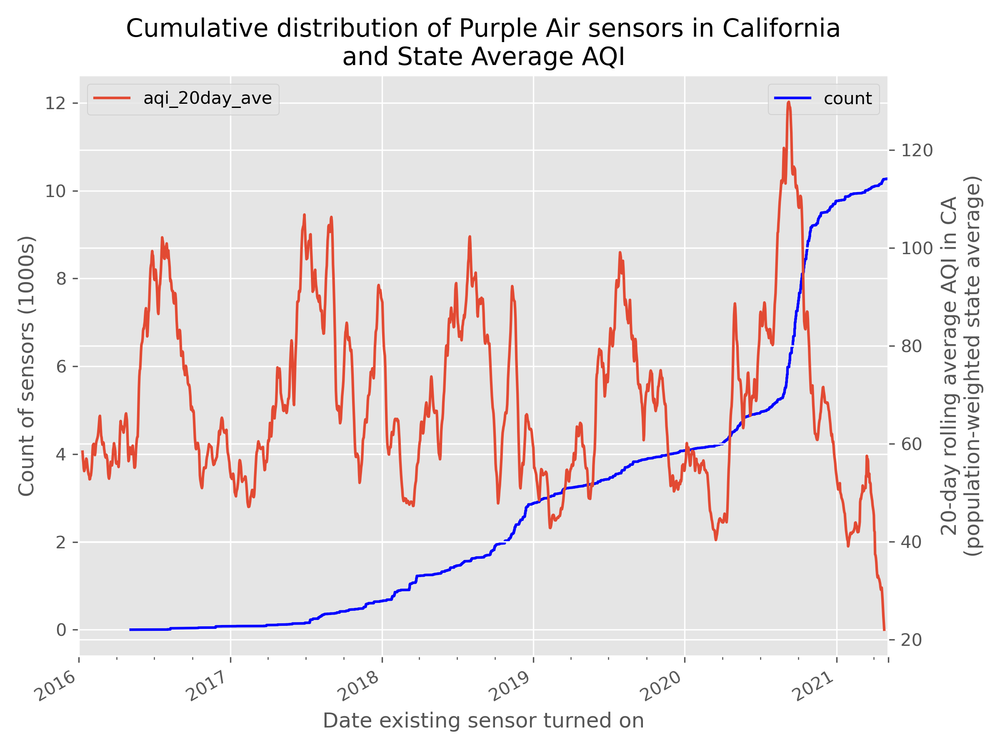

```{r setup, include=FALSE}
knitr::opts_chunk$set(echo = TRUE)
```
<!--
R version 3.6.3 (2020-02-29)
Purpose of script: Second Year Paper summary statistics

Notes: Need to ps2a.R from ps2a folder (without Rstudio being started first)
       if Rstudio is already started, the working directory will not be set
       to the ps2a/ folder
       
       \usepackage{dcolumn}: dcolumn is needed in latex compilation 
-->

```{r Settings, echo=FALSE}
# stargazer table type (html, latex, or text)
# Change to latex when outputting to PDF, html when outputting to html
table_type = "text"
```

```{r packages, results='hide', message=FALSE, echo=F}
library(tidyverse)
library(foreign)
library(stargazer)
library(ggplot2)
library(lubridate)
library(kableExtra)
```

# Geographical Distribution of Purple Air Sensors

We can see from the figure below that the majority of Purple Air sensors are currently concentrated in the United States and Europe.


*Note*: These location data were collected in 2021, and I am unsure if there is a way to see the historical location of existing sensors or information on sensors that dropped out of the network.

\FloatBarrier
\newpage
In the US, the sensors are concentrated on the coastlines, with the majority in California.



\FloatBarrier
\newpage
Within California, we can see the sensors are clustered around the Bay area and LA.



\FloatBarrier
\newpage
# Distribution of adoption over time

For California, we can see from the below graph that adoption of Purple Air pollution monitors (in blue) increased steadily until summer of 2020, when adoption went up dramatically. There were particularly bad smoke days in populated areas of California that summer (e.g., "Mars Day"). However, these data are biased toward recent increases in adoption because I only have access to the sensors that are currently in the network -- I have no data on the sensors that dropped out, therefore the increases pre-2020 are likely understated.

A more interesting red graph would probably be population-distance-weighted fires per-month or a population-weighted measure of visibility.



```{r summary stats, echo=F, warning=F}
pa = read.csv('../../data/purpleair/date_created_california_manual_request_2021-11-09_metadata.csv') %>%
    mutate(date_start = as.Date(date_start)) %>%
    arrange(date_start) %>% mutate(order=(1:nrow(.))) %>%
    select(-date_created)
pa_counts = pa %>% count(COUNTYFP, year(date_start), sort = TRUE)

year_stats0 = pa %>%
    count(year(date_start))

year_stats1 = pa_counts %>% 
    group_by(`year(date_start)`) %>% 
    summarize(max_n = max(n))
pa_county = read.csv('../../data/purpleair/current_pa_sensors_metadata.csv')
pop = read.csv('../../data/gis/co-est2019-annres-06.xlsx')
aqi = read.csv('../../data/epa/aqi/daily_aqi_by_county_2016-2021.csv')
# stargazer(pa, type='text')

year_stats = pa %>%
    group_by(year(date_start)) %>%
    summarise(pm2.5_ym = mean(pm2.5, na.rm=T)) %>%
    merge(., year_stats0) %>%
    merge(., year_stats1)

year_stats %>%
    rename("Year Sensor Joined the Network"="year(date_start)",
           "Mean PM2.5"="pm2.5_ym",
           "Sensors joined in CA"=n,
           "Max # of Sensors joining in any CA county"=max_n) %>%
    kbl(caption = "Statistics of Purple Air Pollution Sensors Joining the Network", 
        align = 'ccc', digits = 3) %>%
    kable_minimal()

pa2 = merge(pa, pa_county, by.x = "sensor_index", by.y = "id")

```

\FloatBarrier

In the Figure 3 and Table 1, we see that many Purple Air pollution sensors joined
the network in years of high pollution, or just after years of high pollution.
One research question I hope to address is what might explain the spatial and
temporal missingness of pollution data from county-level sensors that the EPA
requires non-attainment counties to keep. Because Purple Air monitors create a 
network spread over the state, I can estimate pollution in areas that don't have
EPA monitors or in places that have EPA monitors but at times when they are shut
off. However, from Figure 2, we can see the distribution of Purple Air monitors
is not distributed evenly or randomly.


\FloatBarrier
\newpage
# Data plan

<!-- This could become a section of your final paper. Describe the dataset. Provide summary statistics for relevant variables. Discuss issues that may affect your estimates. For example: measurement error, reverse causality, omitted variables bias, weak instruments, failure to converge. -->

<!-- Description: Several page writeup, suitable for inclusion in your final paper. Your advisor must sign off on this output. -->

I am planning to limit my second year project to California and focus on
comparing Purple Air PM2.5 data to EPA monitor data. I have not yet finished
collecting PM2.5 data from Purple Air monitors but plan to collect years
2016-2021 for all California sensors via the Purple Air API. I am also in the
process of collecting EPA PM2.5 data via the EPA API and have a small sample
from Meredith.

In order to calibrate a selection model into Purple Air adoption, I plan to
collect Census Block Group level demographic data and calibrate the model on the
census block group level over 2018-2020 (inclusive). I also plan to collect
weather data from PRISM.

To model measurement error of sensors (EPA sensors vs. Purple Air sensors), I
plan to use pollution distribution data generated for IPCC climate models. I've
been told these data are available to download and are probably the best measure
of "ground truth" that I have access to.


# Issues that will affect my estimates of pollution

Measurement error from the Purple Air monitors will need to be addressed. I plan
to explore a combination of averaging over multiple sensors and regression-based
correction using EPA monitors that are near some Purple Air monitors as ground 
truth pollution for that location.

I also plan to estimate a selection model into Purple Air adoption so omitted
variable bias will be a large concern. I will have census data at the census
block group level that I can match to the location of the PA monitors. But that
is not unit-level data so also suffers from measurement error if I am estimating
an adoption model at the unit level. I am also interested in modeling this as
a binary discrete choice model with block- or county-level adoption shares (percentage
of the PA monitors adopted in that month, in that county). With either of these
models of adoption, I will need to instrument PA sensor prices, but since it is
a homogeneous good sold by only one firm and the prices have remained nearly the
same for 4 years, I would predict I will have a weak instrument problem.


