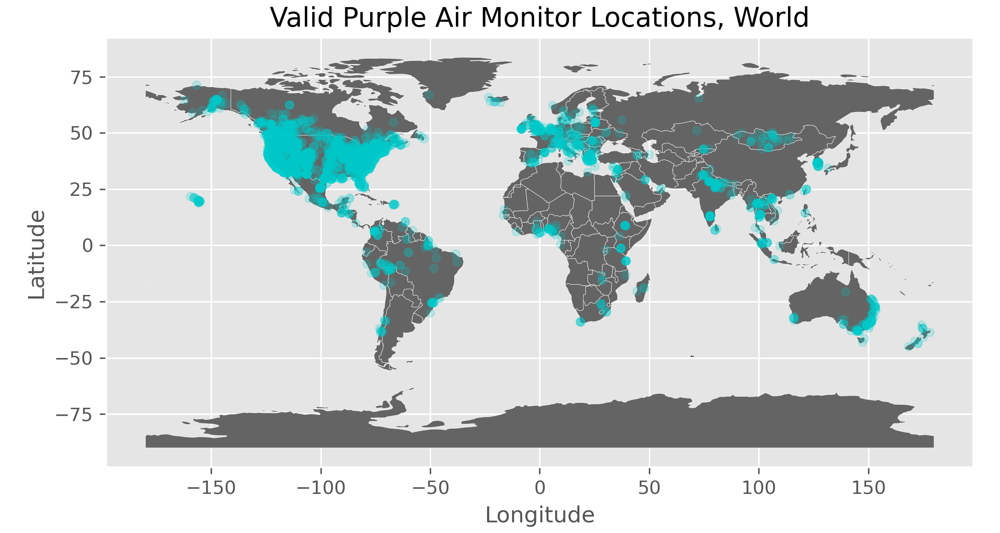

```{r setup, include=FALSE}
knitr::opts_chunk$set(echo = TRUE)
```
<!--
R version 3.6.3 (2020-02-29)
Purpose of script: Second Year Paper summary statistics

Notes: Need to ps2a.R from ps2a folder (without Rstudio being started first)
       if Rstudio is already started, the working directory will not be set
       to the ps2a/ folder
       
       \usepackage{dcolumn}: dcolumn is needed in latex compilation 
-->

```{r Settings, echo=FALSE}
# stargazer table type (html, latex, or text)
# Change to latex when outputting to PDF, html when outputting to html
table_type = "text"
```

```{r packages, results='hide', message=FALSE, echo=F}
library(tidyverse)
library(foreign)
library(stargazer)
```



